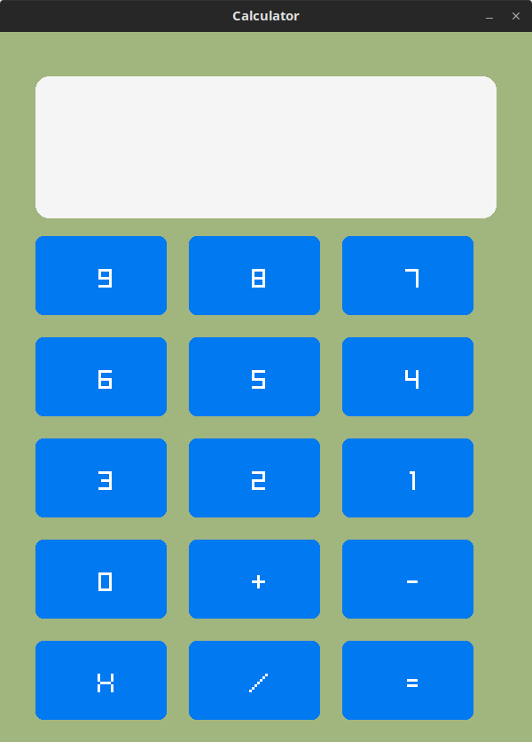

# Raylib Calculator

A simple calculator project built using C++ and [Raylib](https://www.raylib.com/).  
This project was created for learning and practice purposes.

## Features

- Basic UI with buttons
- Input handling
- Addition, subtraction, multiplication, and division

## Build Instructions

```bash
g++ main.cpp src/*.cpp src/utils/*.cpp -Iinclude -o calculator -lraylib -lGL -lm -lpthread -ldl -lrt -lX11
./calculator


Here is a screenshot of the project
